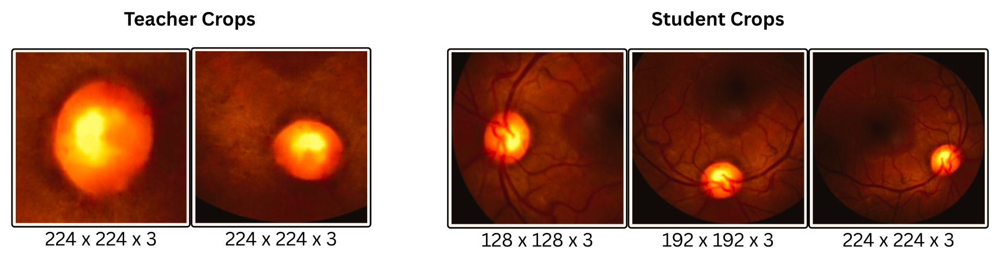
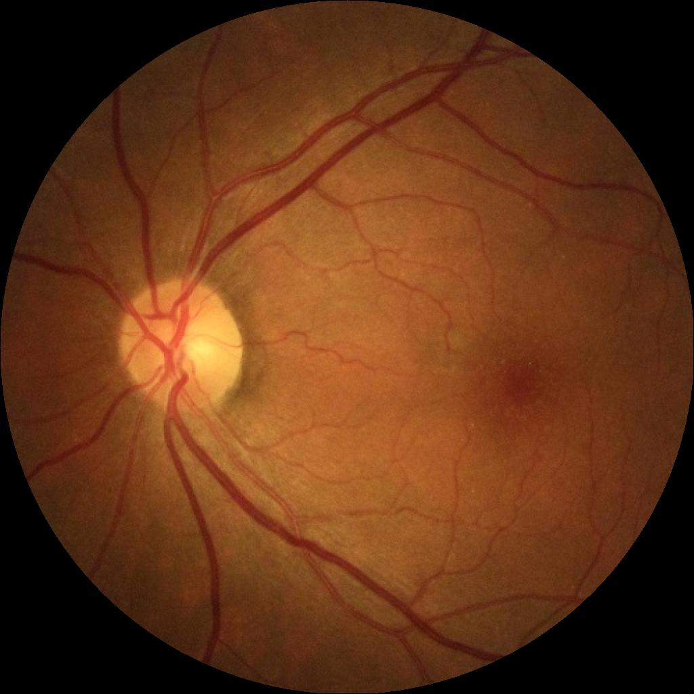
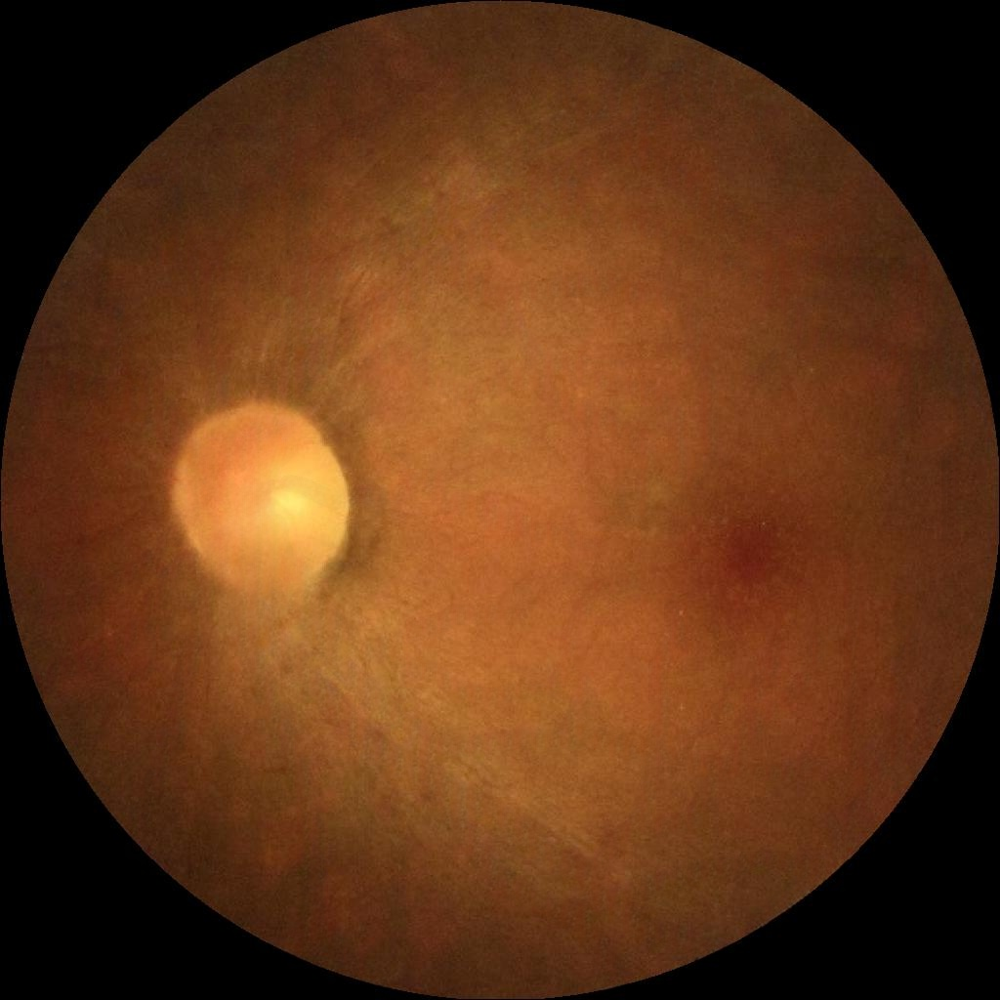

# Task-DINO: Augmentation Strategy for DINO in Glaucoma Classification

Official implementation of *"Augmentation Strategy for DINO in Glaucoma Classification."* Task-DINO is a DINO-based self-supervised framework for glaucoma classification from color fundus photographs.

The method uses an **InfoMin-guided, asymmetric teacher–student crop assignment**: the teacher receives vessel-free crops of the optic disc, while the student receives three multi-scale crops, each containing the optic disc. This asymmetry steers the learned prototype space toward disc/cup morphology — the primary diagnostic signal for glaucoma — rather than forcing consistency across anatomically unrelated crops as in vanilla DINO.



## 👁️ Project Structure
```
├── dataset/
│   ├── train/         # circular-cropped fundus images (glaucoma/normal)
│   ├── train_mask/    # cleaned optic disc/cup + vessel segmentation masks
│   └── train_paint/   # vessel-inpainted (vessel-free) images for teacher crops
├── fundus_dino/
│   ├── task_dino.py         # main training script (task-aware DINO)
│   ├── vanilla_dino.py      # baseline DINO training (no vessel-aware crops)
│   ├── eval_linear.py       # linear probing + AUROC/DeLong CI evaluation
│   ├── vision_transformer.py# ViT backbone + DINO head
│   └── utils.py              # training utilities
├── helpers/
│   ├── crop.py         # circular fundus crop extraction
│   ├── quality.py       # QuickQual-based image quality filtering
│   ├── mask.py          # optic disc/cup mask cleaning + quality gate
│   └── inpaint.py       # LaMa-based vessel inpainting (train_mask -> train_paint)
├── weights/
│   ├── task_dino/       # pretrained task-aware DINO checkpoint (download separately)
│   └── vanilla_dino/    # pretrained vanilla DINO checkpoint (download separately)
├── requirements.txt
└── readme.md
```

## 🛠️ Setup
Create and activate a dedicated conda environment named `taskdino`, then install dependencies:
 
```bash
conda create -n taskdino python=3.12 -y
conda activate taskdino
 
pip install --upgrade pip
pip install -r requirements.txt
```
 
All commands below assume the `taskdino` environment is active.

## 🤗 Weights
Pretrained DINO checkpoints are not included in this repo. Download them and place inside `weights/task_dino/` and `weights/vanilla_dino/`:
[OSF project link](https://osf.io/yejrv/overview?view_only=2787ef7ecf3646d896f34bb10dacdfe3)

## 🧩 Data Preparation
Raw fundus images are turned into training-ready triplets (`train`, `train_mask`, `train_paint`) through the `helpers/` scripts, run in the following order. The pipeline is designed as a **funnel with filtering gates**: an image only proceeds to the next stage if it survives the current one, and any image that is dropped at any stage is discarded. This keeps `dataset/train`, `dataset/train_mask`, and `dataset/train_paint` in lockstep — **all three folders must end up with the same number of files**, with every image having a matching mask and paint counterpart.

**Naming convention:** for a source image `image_name.jpg`, the pipeline produces:
- `dataset/train/image_name.jpg` — circular-cropped fundus image
- `dataset/train_mask/image_name_mask.png` — cleaned disc/cup (or vessel) mask
- `dataset/train_paint/image_name_paint.jpg` — vessel-inpainted, vessel-free image

**Example** (`07_LAG_0087`, from `dataset/*/normal/`) — the three existing files for this image:

| Stage | File | Preview |
|---|---|---|
| `train` (crop) | `dataset/train/normal/07_LAG_0087.jpg` |  |
| `train_mask` | `dataset/train_mask/normal/07_LAG_0087_mask.png` |  |
| `train_paint` (vessel-free) | `dataset/train_paint/normal/07_LAG_0087_paint.jpg` |  |

**1. Circular cropping — `crop.py`**
Detects the fundus circle in each raw image, saves a tight, padded square crop, and resizes the final output to **1024×1024** into `dataset/train/`. This removes the black background/border around the fundus and normalizes both framing and resolution before any downstream processing.
```bash
python helpers/crop.py --image_path <path_to_raw_image> --output_dir ./dataset/train
```

**2. Quality filtering — `quality.py`**
Runs each cropped image through QuickQual (an off-the-shelf DenseNet-121 feature extractor + SVM classifier) to flag low-quality/ungradable images. Images flagged as bad are **removed from `dataset/train`** here so they never reach mask generation or inpainting, keeping the three output folders aligned.
- Download the QuickQual model weights from the official repo: [github.com/justinengelmann/QuickQual](https://github.com/justinengelmann/QuickQual)
- Place the classifier `.pkl` file under `weights/` (default expected path: `./weights/quickqual_dn121_512.pkl`)

**3. Optic disc/cup and vessel segmentation**
- Download a U-Net-based optic disc/cup segmentation model and a separate vessel segmentation model (weights not included in this repo — obtain pretrained checkpoints for both, e.g. from public fundus segmentation repos).
- Run the optic disc/cup U-Net over each image in `dataset/train/` to produce a raw disc/cup mask per image, cross-validated against an independent model on mask overlap and disc circularity to discard poorly localized images.
- Run the vessel segmentation model over the same images to produce a corresponding vessel mask (used later in Step 5).

**4. Mask cleaning and quality gating — `mask.py`**
Each raw disc/cup mask from Step 3 is passed through `mask.py`, which:
- keeps only the largest connected component of the disc (removes stray/false-positive blobs),
- computes disc circularity and cup-to-disc ratio,
- flags the mask as **good** or **bad** based on these checks (circularity > 0.6, cup-to-disc ratio > 0.05, and a valid cleaning outcome).

If a mask is flagged **bad**, discard its source image from `dataset/train` as well, so a bad mask never results in an orphaned image or a missing mask/paint pair. Cleaned, good masks are saved as `dataset/train_mask/image_name_mask.png`.
```bash
python helpers/mask.py --mask <path_to_raw_disc_mask> --out ./dataset/train_mask/image_name_mask.png
```

**5. Vessel inpainting — `inpaint.py`**
For every image that survived Steps 2 and 4, the vessel mask from Step 3 is used with LaMa to inpaint (remove) vessels from the fundus image, producing a vessel-free image saved as `dataset/train_paint/image_name_paint.jpg`. Mask dilation and inpainting strength are tuned conservatively to avoid encroaching on the disc margin and to keep inpainted regions visually consistent with surrounding tissue. These vessel-free images are what the two DINO teacher crops are drawn from at training time.

```bash
python helpers/inpaint.py --image_path <path_to_train_image> --mask_path <path_to_vessel_mask> --output_dir ./dataset/train_paint
```

After all five steps, `dataset/train`, `dataset/train_mask`, and `dataset/train_paint` contain the same filtered set of images, 1:1:1 by name, ready for DINO pretraining — yielding a final pretraining corpus of **~81K fundus images** aggregated across the six datasets below, each with a corresponding disc mask and vessel-free counterpart.

**Pretraining datasets (pretraining corpus):** AIROGS, FIVES, LAG, CATARACT, ORIGA, HYGD

## 🎲 Pretraining
Task-aware DINO (teacher: 2 vessel-free, disc-centered crops; student: 3 multi-scale disc-containing crops):
```bash
python fundus_dino/task_dino.py --data_path ./dataset --output_dir ./output_dir
```

Vanilla DINO baseline (standard multi-crop, no vessel/disc awareness):
```bash
python fundus_dino/vanilla_dino.py --data_path ./dataset --output_dir ./output_dir
```

Key architecture/training settings (defaults in scripts): ViT-Small backbone (21M parameters, initialized from scratch), patch size 16, 4096-d projection head, 200 epochs, batch size 256, base LR 5e-4, student/teacher temperature 0.1/0.04.

## 🎯 Evaluation
Generalization is measured by training a linear classifier on frozen CLS-token embeddings, evaluated across **seven glaucoma benchmarks**.

**Data preparation for evaluation** — two linear-probe regimes:
- **REFUGE (train split, ~1.2K images)** — low-data regime.
- **AIROGS (~78K images)** — large-scale regime. `crop.py` followed by `quality.py` (QuickQual filtering) is applied to obtain the final, quality-filtered set of ~78K images.

** Evaluation datasets:** REFUGE (test split), ACRIMA, LAG, ORIGA, FIVES, PAPILA, CHAKSU.

Linear probing is run on frozen CLS-token features, reporting AUROC with 95% DeLong confidence intervals for each benchmark:
```bash
python fundus_dino/eval_linear.py \
    --pretrained_weights ./weights/task_dino/task_checkpoint.pth \
    --data_path ./dataset \
    --output_dir ./output_dir/linear_probe/task_dino \
    --evaluate
```

## 🏛️ Citation
If you use this code, please cite:
Ashish Kumar Meena and Chandra Sekhar Seelamantula, 
"Augmentation Strategy for DINO in Glaucoma Classification," 2026.

## 🙏 Acknowledgements
This work was carried out at the Spectrum Lab, Department of Electrical Engineering, Indian Institute of Science (IISc), Bengaluru, under the supervision of Prof. Chandra Sekhar Seelamantula.

Funding support from **ZEISS India** and the **Kotak-IISc AI/ML Centre** is gratefully acknowledged.
